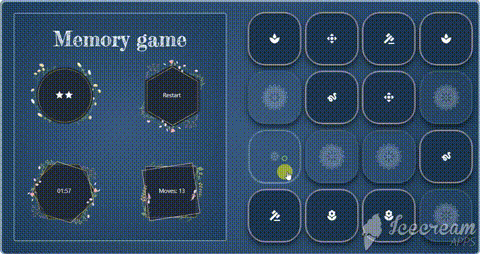

# Memory Game
Memory game or Matching game is a game that require players to match similar cards.
where the game board consists of sixteen cards composed of 8 pairs, face down in random order.

## How to Play:

You can play the game from [this link](https://gifted-bhabha-68f119.netlify.com/).

or 

* Use git to download the game source code.
* Load app.html in browser.
* Play the game

## Game Behavior

- The game randomly shuffles the cards. Player wins once all cards have successfully been matched.

- When the player make his first move, timer should  start. Once the player wins the game, the timer stops.

- Game displays the current number of moves a user has made.

- A restart button allows the player to reset the game board at any time of the game: the timer, and the star rating.
- The game displays a star rating that reflects the player's performance. At the beginning of a game, it should display 3 stars. a successful move adds a star and unsuccessful move removes a star.

- When a player wins the game, a modal appears for congratulations and asks for one more game. It tells the player how much time it took to win the game, and what the star rating was.

## Tools Used

* [material-icons](https://material.io/resources/icons/?style=baseline) was used to display game card's icons.